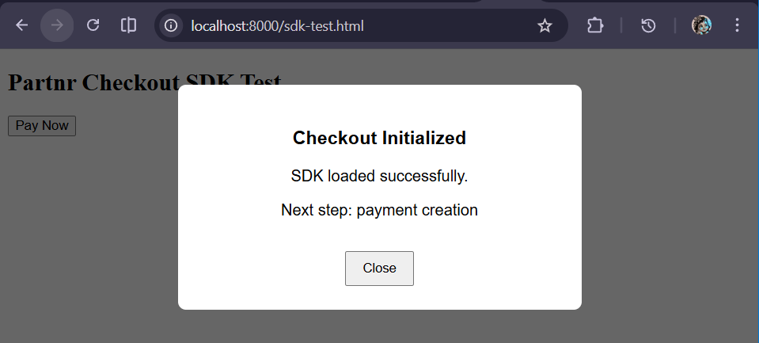
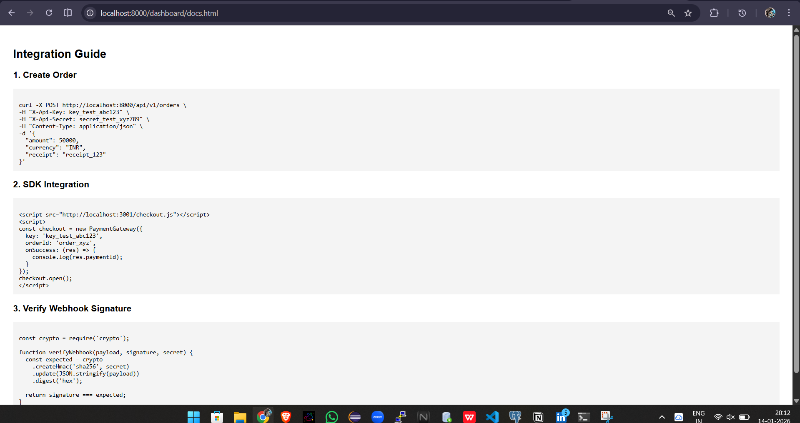
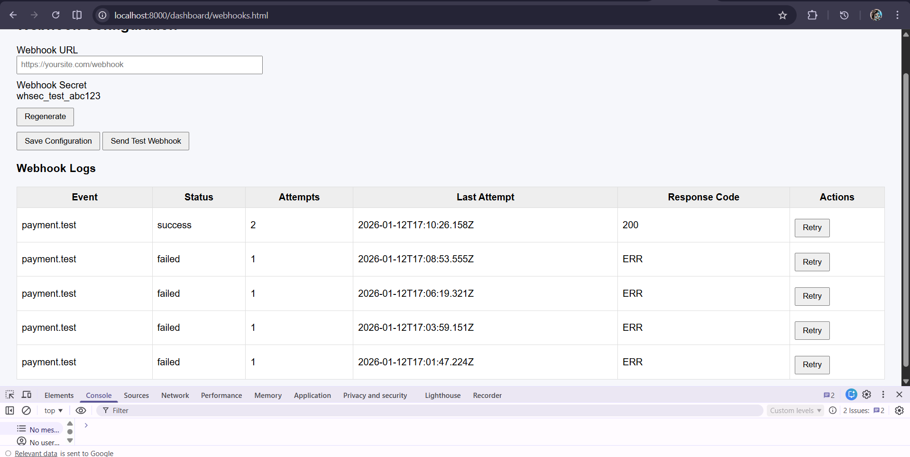
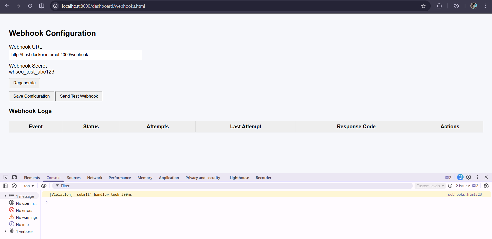

# Partnr Payment Gateway — Async Processing System

A production-ready payment gateway built with asynchronous job processing, webhook delivery with retry mechanisms, refund management, and an embeddable JavaScript SDK.

This project demonstrates **real-world backend architecture patterns** used by companies like **Stripe, Razorpay, and PayPal**, including message queues, background workers, idempotent APIs, and event-driven webhooks.

---

##  Objective

Transform a basic payment gateway into a **scalable, reliable, production-grade system** by implementing:

- Asynchronous payment & refund processing
- Redis-based job queues with worker services
- Secure webhook delivery with retries
- Embeddable checkout SDK
- Idempotent API operations
- Dashboard for integration & monitoring

---

##  Features

-  **Asynchronous Payments** using Redis + Bull job queues  
-  **Worker Services** for payments, refunds, and webhooks  
-  **Webhook Delivery** with HMAC-SHA256 signature verification  
-  **Automatic Retry Logic** with exponential backoff (5 attempts)  
-  **Refund Management** (full & partial refunds, async processing)  
-  **Idempotency Keys** to prevent duplicate charges  
-  **Embeddable JavaScript SDK** (modal + iframe, no redirects)  
-  **Dashboard** for webhook configuration, logs, and API docs  
-  **Fully Dockerized Setup** for easy evaluation  

---

## High-Level Architecture

**Flow Overview:**

1. Client creates payment → API returns `pending`
2. Payment job is pushed to Redis queue
3. Worker processes payment asynchronously
4. Payment result triggers webhook job
5. Webhook worker delivers event with retries
6. Refunds follow the same async job pattern

---

## Tech Stack

- **Backend:** Node.js, Express
- **Database:** PostgreSQL
- **Queue:** Redis + Bull
- **Workers:** Dedicated Docker worker service
- **Frontend:** HTML, CSS, JavaScript
- **SDK:** JavaScript (UMD bundle)
- **Containerization:** Docker & Docker Compose

---

## Setup Instructions

### Prerequisites
- Docker
- Docker Compose

### Start the Application
```bash
docker-compose up -d
```
## 🔌 Services & URLs

| Service | URL / Port |
|------|------|
| API + Dashboard | http://localhost:8000 |
| Checkout (SDK & iframe) | http://localhost:3001 |
| Redis | 6379 |
| PostgreSQL | 5432 |

---

## 📊 Dashboard Pages

Dashboard is served by the **API container**.

- **Webhook Configuration & Logs**  
  http://localhost:8000/dashboard/webhooks.html

- **API & SDK Documentation**  
  http://localhost:8000/dashboard/docs.html

---

## 🔐 Environment Variables

Configured via `docker-compose.yml`.

**Key variables:**
- `DATABASE_URL`
- `REDIS_URL`
- `TEST_MODE=true`
- `TEST_PAYMENT_SUCCESS=true`
- `WEBHOOK_RETRY_INTERVALS_TEST=true`

> Test mode ensures deterministic behavior for automated evaluation.

---

## 📡 API Endpoints (Key)

### Create Payment
**POST** `/api/v1/payments`

**Headers:**
- `X-Api-Key`
- `X-Api-Secret`
- `Idempotency-Key` (optional)

**Response:**
```json
{
  "status": "pending"
}
```

## 📡 API Endpoints

### Capture Payment
**POST** `/api/v1/payments/{payment_id}/capture`

---

### Create Refund
**POST** `/api/v1/payments/{payment_id}/refunds`

- Supports **partial and full refunds**
- Processed asynchronously via worker

---

### Get Refund
**GET** `/api/v1/refunds/{refund_id}`

---

### Webhook Logs
**GET** `/api/v1/webhooks`

---

### Retry Webhook
**POST** `/api/v1/webhooks/{webhook_id}/retry`

---

### Job Queue Status (Required for Evaluation)
**GET** `/api/v1/test/jobs/status`

Returns queue statistics and worker status.

---

## 🔔 Webhook System

- **Signature Algorithm:** HMAC-SHA256  
- **Header:** `X-Webhook-Signature`  
- **Payload:** Exact JSON string (no formatting changes)

### Retry Schedule (Production)
1. Immediate  
2. +1 minute  
3. +5 minutes  
4. +30 minutes  
5. +2 hours  

> Test mode uses shorter retry intervals.

---

## 🧩 Embeddable JavaScript SDK

### Include SDK
```html
<script src="http://localhost:3001/checkout.js"></script>
```

### Usage

```js
const checkout = new PaymentGateway({
  key: 'key_test_abc123',
  orderId: 'order_xyz',
  onSuccess: (response) => {
    console.log('Payment success:', response);
  },
  onFailure: (error) => {
    console.log('Payment failed:', error);
  },
  onClose: () => {
    console.log('Checkout closed');
  }
});

checkout.open();
```

🧪 Testing & Evaluation Support

Deterministic test modes enabled

Job queue status endpoint available

Test merchant webhook receiver included

SDK and dashboard include data-test-id attributes

📸 Screenshots

(Add your screenshots here)

Dashboard Webhook Configuration Page

Dashboard API Documentation Page

Example:
## 📸 Screenshots

### Dashboard – Webhook Configuration & Logs







### Video Demo

## End-to-End Demo Video
### https://youtu.be/es-NkGgRcO0

The video demonstrates:

Payment creation

Async processing

Webhook delivery

Dashboard usage

SDK integration

### Project Structure (Simplified)
```text
backend/
  ├── src/
  │   ├── jobs/
  │   ├── workers/
  │   ├── routes/
  │   └── utils/
checkout-widget/
  ├── src/sdk/
  └── dist/checkout.js
dashboard/
  ├── docs.html
  └── webhooks.html
docker-compose.yml
submission.yml
screenshots
README.md

```
